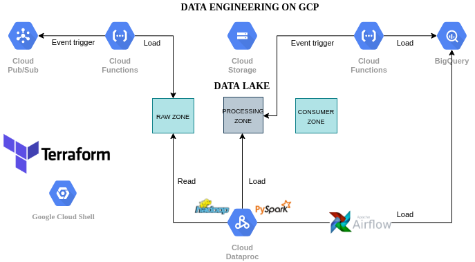

### Data Engineering on GCP



#### Some choices in this project

- Python
- Terraform
- Docker
- Apache Pyspark
- Apache Airflow
- GCP

#### Dataset

This project uses the titanic dataset as an example.

#### Implementation

This project involves the implementation of the following examples.

1. A function triggered from a pub/sub event and stores the data into raw data lake zone.
2. An airflow pipeline with a dataproc cluster that will process the file and save it in the data lake processing zone. 
   This step will create two dataset file (passengers.parquet, tickets.parquet)
3. A function triggered from a bucket storage event and stores the data into Bigquery.
4. An airflow pipeline that will load the data from the data lake processing zone to the Bigquery.

#### Create Service Account and Roles 

1. IAM & Admin -> Service Accounts -> ADD
2. Role
   - BigQuery Admin
   - Cloud Functions Admin
   - Cloud Functions Service Agent
   - Dataproc Administrator
   - Service Account User
   - Pub/Sub Admin
   - Editor

After setting up the roles, save the key JSON in the config folder. Rename the key file to 'service-account.json'

#### How to execute - docker project

```bash
docker build -t westerley/docker-airflow:2.0.1 .
docker-compose -f docker-compose-CeleryExecutor.yml up -d --build
```

#### Connection

- Conn Id: name of connection, use this ID in your dag definition files
- Conn Type: select the Google Cloud
- Keyfile Path: local file path to the JSON keyfile's
- Project id: corresponds to the project that your service account belongs to
- Scopes: it is recommended to use https://www.googleapis.com/auth/cloud-platform